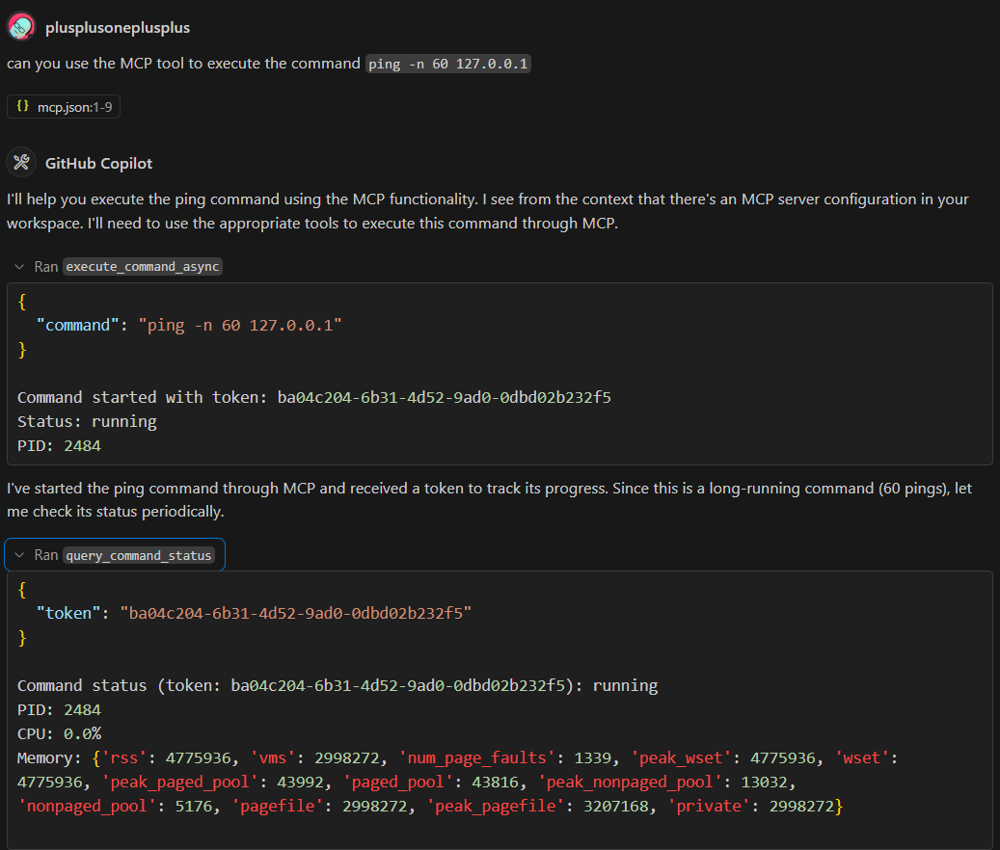

# MCP Server

The MCP Server provides a flexible framework for AI-powered command execution and tool management.

## Project Structure

The MCP project is organized into several components:

- **mcp_core/**: Core types and adapters
  - **mcp_core/tests/**: Tests for core types and functionality
  
- **mcp_tools/**: Utility tools and implementations
  - **mcp_tools/command_executor/**: Command execution utilities
  - **mcp_tools/tests/**: Tests for utility tools

- **server/**: Main MCP server implementation
  - **server/tests/**: Tests for server-specific functionality
  - **server/.private/**: Directory for private configurations (git-ignored)

- **scripts/**: Utility scripts for project management

- **assets/**: Project assets and images for documentation

## Installation

### Manual installation

```bash
# Using uv (recommended):
uv pip install -e ./mcp_core
uv pip install -e ./mcp_tools
uv pip install -e .

# Or using pip:
pip install -e ./mcp_core
pip install -e ./mcp_tools
pip install -e .
```

This will install all the local packages in development mode, allowing you to make changes to the code while using the packages.

## Configuration 

The MCP server uses a flexible configuration system that supports both default and user-specific settings. Configuration files are stored in YAML format.

### Configuration Files

The server uses two main configuration files:

1. `prompts.yaml` - Defines available prompts and their templates
2. `tools.yaml` - Defines available tools and their configurations

### User-Specific Configuration

To maintain private configurations that won't be tracked in git:

1. Create a `.private` directory in the `server` folder:
   ```bash
   mkdir server/.private
   ```

2. Copy your configuration files to the `.private` directory:
   ```bash
   cp server/prompts.yaml server/.private/
   cp server/tools.yaml server/.private/
   ```

3. Customize the files in `.private` as needed

The system will:
- First look for configuration files in the `.private` directory
- Fall back to the default configuration files if private versions don't exist
- The `.private` directory is automatically ignored by git

### External Private Tool Directory

You can also define a separate directory for private tools and configurations outside the project directory:

1. Set the `PRIVATE_TOOL_ROOT` environment variable to point to your private tools directory:
   ```bash
   # Linux/Mac
   export PRIVATE_TOOL_ROOT=/path/to/your/private/tools
   
   # Windows (PowerShell)
   $env:PRIVATE_TOOL_ROOT = "D:\path\to\your\private\tools"
   
   # Windows (CMD)
   set PRIVATE_TOOL_ROOT=D:\path\to\your\private\tools
   ```

2. Create and customize your configuration files in this directory

3. The server will look for configuration files in this priority order:
   1. `PRIVATE_TOOL_ROOT` directory (if set)
   2. `.private` directory in the server folder
   3. Default files in the server folder

This approach allows you to:
- Keep private tools and configurations completely separate from the project
- Share the same private tools across multiple projects
- Easily switch between different sets of private tools by changing the environment variable

## Tool Types

The MCP server supports several types of tools:

1. **Regular Tools**: Standard tools defined in the tools.yaml configuration
2. **Script-Based Tools**: Tools that execute external scripts with configurable parameters
3. **Task-Based Tools**: Pre-defined tasks that can be executed with platform-specific commands
4. **Async Command Execution**: Tools that execute commands asynchronously and allow status tracking

## Running Tests

The MCP project includes test suites for each component:

- **mcp_core/tests/**: Tests for the core types and adapters
- **mcp_tools/tests/**: Tests for utility tools and functionality
- **server/tests/**: Tests for server-specific functionality

You can run tests manually using pytest:

```bash
# Run all tests
python -m pytest

# Run tests for a specific component
python -m pytest mcp_core/tests
python -m pytest mcp_tools/tests
python -m pytest server/tests
```

## Configuring MCP Server in Cursor/VSCode

```json
{
    "mcpServers": {
      "mymcp": {
        "command": "python",
        "args": ["server/main.py"],
        "env": {
          "GIT_ROOT": "${workspaceFolder}",
          "PRIVATE_TOOL_ROOT": "${workspaceFolder}/.private"
        }
      },
      "mymcp-sse" : {
        "url": "http://0.0.0.0:8000/sse"
      }
    }
}
```

## Demo Screenshots


