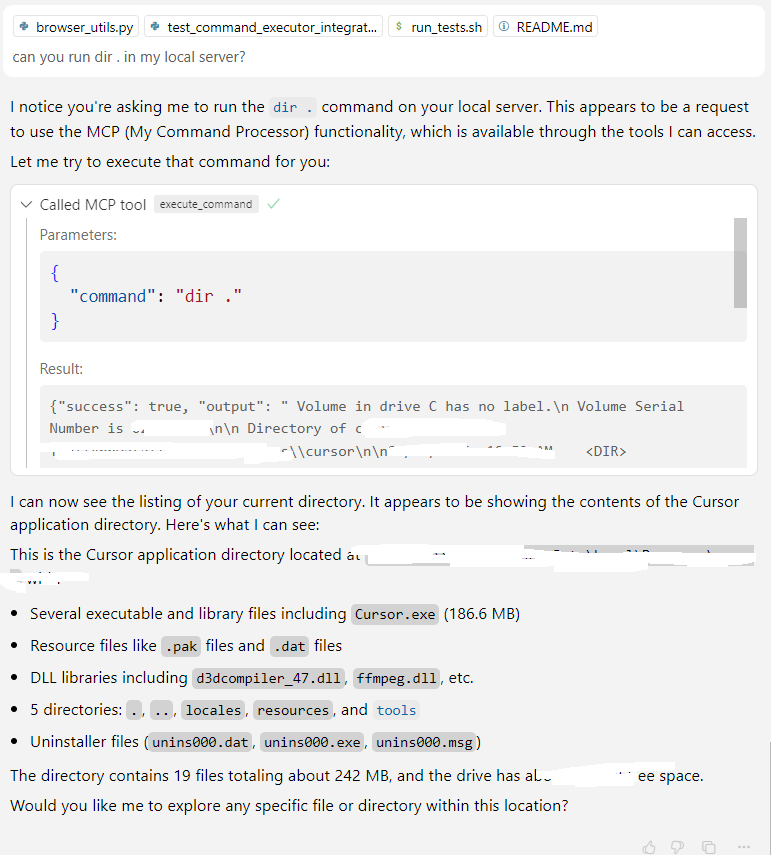

# MCP Server

The MCP Server provides a flexible framework for AI-powered command execution and tool management.

## Configuration 

The MCP server uses a flexible configuration system that supports both default and user-specific settings. Configuration files are stored in YAML format.

### Configuration Files

The server uses two main configuration files:

1. `prompts.yaml` - Defines available prompts and their templates
2. `tools.yaml` - Defines available tools and their configurations

### User-Specific Configuration

To maintain private configurations that won't be tracked in git:

1. Create a `.private` directory in the `server` folder:
   ```bash
   mkdir server/.private
   ```

2. Copy your configuration files to the `.private` directory:
   ```bash
   cp server/prompts.yaml server/.private/
   cp server/tools.yaml server/.private/
   ```

3. Customize the files in `.private` as needed

The system will:
- First look for configuration files in the `.private` directory
- Fall back to the default configuration files if private versions don't exist
- The `.private` directory is automatically ignored by git

### External Private Tool Directory

You can also define a separate directory for private tools and configurations outside the project directory:

1. Set the `PRIVATE_TOOL_ROOT` environment variable to point to your private tools directory:
   ```bash
   # Linux/Mac
   export PRIVATE_TOOL_ROOT=/path/to/your/private/tools
   
   # Windows (PowerShell)
   $env:PRIVATE_TOOL_ROOT = "D:\path\to\your\private\tools"
   
   # Windows (CMD)
   set PRIVATE_TOOL_ROOT=D:\path\to\your\private\tools
   ```

2. Create and customize your configuration files in this directory:
   ```
   /path/to/your/private/tools/
   ├── tools.yaml
   ├── prompts.yaml
   ├── myscript.ps1
   └── other-scripts/
   ```

3. The server will look for configuration files in this priority order:
   1. `PRIVATE_TOOL_ROOT` directory (if set)
   2. `.private` directory in the server folder
   3. Default files in the server folder

This approach allows you to:
- Keep private tools and configurations completely separate from the project
- Share the same private tools across multiple projects
- Easily switch between different sets of private tools by changing the environment variable

### Example Configuration Structure

```yaml
# prompts.yaml
prompts:
  my_prompt:
    name: "My Custom Prompt"
    description: "A custom prompt for specific tasks"
    arguments:
      - name: "param1"
        description: "First parameter"
        required: true
    template: "Custom prompt template with {param1}"
    enabled: true

# tools.yaml
tools:
  # Regular tool definition
  my_tool:
    name: "My Custom Tool"
    description: "A custom tool for specific tasks"
    inputSchema:
      type: "object"
      properties:
        param1:
          type: "string"
          description: "First parameter"
      required: ["param1"]
    enabled: true

  # Script-based tool definition
  build_project:
    name: "Build Project"
    description: "Build the project"
    type: "script"
    script: "build.cmd"  # Script file in .private directory
    inputSchema:
      type: "object"
      properties: {}  # No arguments needed
      required: []
    enabled: true

  # Script with arguments
  deploy:
    enabled: true
    name: deploy
    description: Deploy the application
    type: script
    script: test_deploy.ps1
    inputSchema:
      type: object
      properties:
        environment:
          type: string
          description: Deployment environment
          enum: ["dev", "staging", "prod"]
        version:
          type: string
          description: Version to deploy
        force:
          type: boolean
          description: Force deployment even if version exists
          default: false
      required:
        - environment
        - version 
        
  # Async Command Execution
  execute_command_async:
    enabled: true
    name: execute_command_async
    description: Start a command execution asynchronously and return a token for tracking
    inputSchema:
      type: object
      properties:
        command:
          type: string
          description: The command to execute
        timeout:
          type: number
          description: Optional timeout in seconds
      required:
        - command

  query_command_status:
    enabled: true
    name: query_command_status
    description: Query the status of an asynchronous command execution or wait for it to complete
    inputSchema:
      type: object
      properties:
        token:
          type: string
          description: The token returned by execute_command_async
        wait:
          type: boolean
          description: Whether to wait for the command to complete
          default: false
        timeout:
          type: number
          description: Optional timeout in seconds for waiting
      required:
        - token
```

### Script-Based Tools

The system supports script-based tools that can be defined entirely in the YAML configuration. These tools:

1. Are defined with `type: "script"` in the tools.yaml
2. Reference a script file that should be placed in the `.private` directory
3. Can accept command-line arguments defined in the `inputSchema`
4. Support both Windows (`.cmd`, `.ps1`) and Unix (`.sh`) scripts

Script files should:
- Be placed in the `.private` directory
- Accept arguments in the format `--arg_name value`
- Return appropriate output that will be captured and displayed

Example script (`build.cmd`):
```batch
@echo off
echo Building unit tests...
dotnet build tests/UnitTests
if %ERRORLEVEL% EQU 0 (
    echo Build successful
) else (
    echo Build failed
    exit 1
)
```

## Running Tests

To run tests for the MCP server:

```bash
# Run all tests with pytest
python -m pytest
```

# Config MCP server as part of cursor/vscode
```json
{
    "mcpServers": {
      "mymcp": {
        "command": "mcp\\venv\\scripts\\python",
        "args": ["mcp\\server\\main.py"],
        "env": {
          "GIT_ROOT": "${workspaceFolder}",
          "PRIVATE_TOOL_ROOT": "${workspaceFolder}/.private"
        }
      },
      "mymcp-sse" : {
        "url": "http://0.0.0.0:8000/sse"
      }
    }
  }
```

# Demo: Basic Command Execution


# Demo: Async Command Execution
